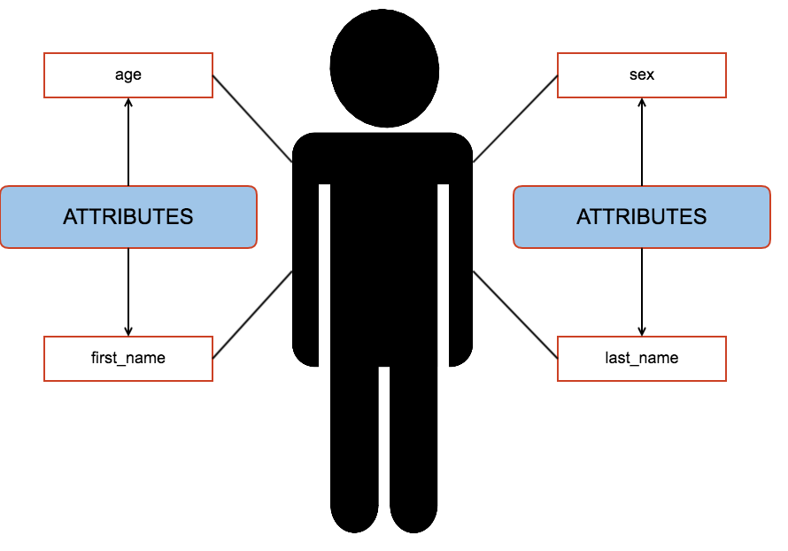
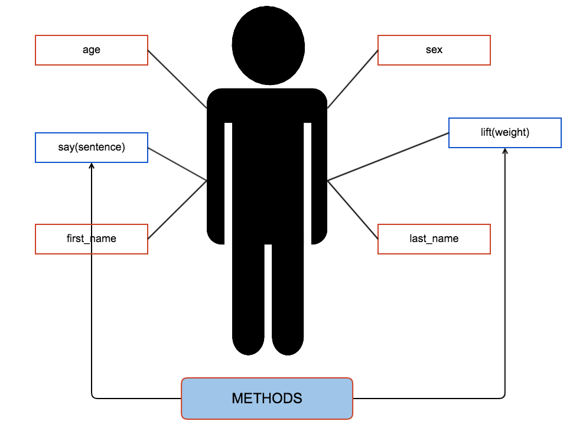
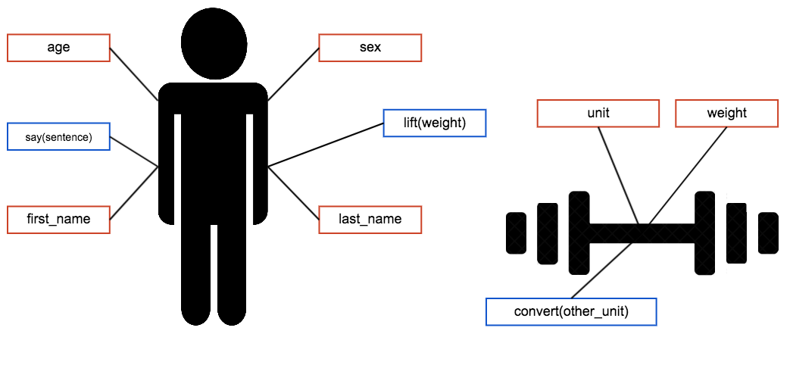
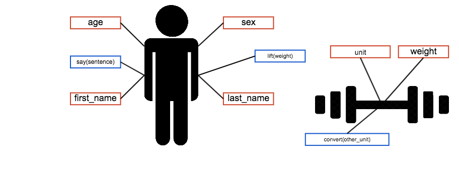
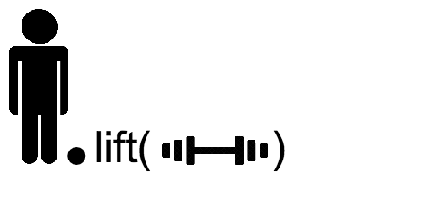
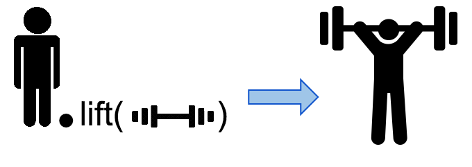
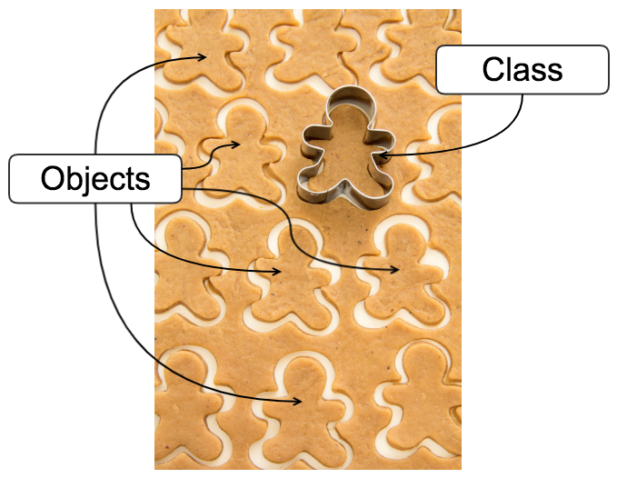
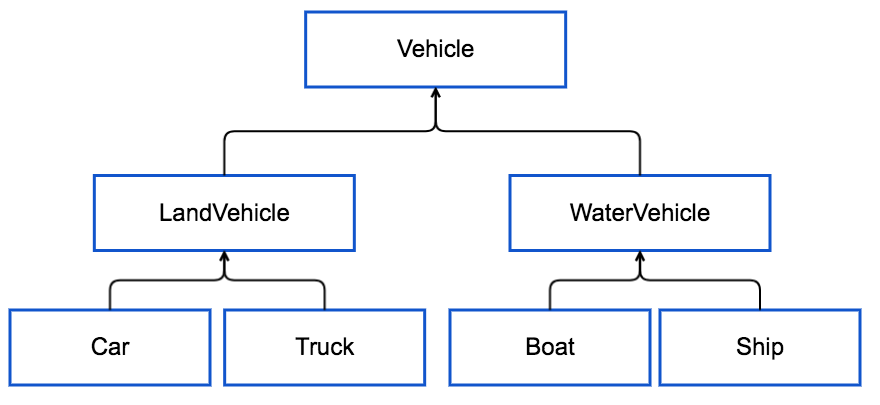

% Python

# Introduction to Object Oriented Programming

## Object

## Object

## Object

## Object

## Object

## Object

## Object

## Object

# Object
- Objects are sets of variables and functiones wrapped together into one entity.
- A **variable** which an object member is called an **attribute**.
- A **function** which is an object member is called a **method**.
- Attributes and methodes are accessed with a ``.`` (dot) operator.

## Class and object
{width=200}

- Classes are the objects definitions.
- They contain a special method which is used to construct and initialize the new object.
    - This method is called `__init__()` in Python.
- Obejects are often called class instances.

## Class definition
~~~python
class Human:
    def __init__(self, first_name, last_name, age, sex):
        self.first_name = first_name
        self.last_name = last_name
        self.age = age
        self.sex = sex

    def say(self, sentence):
        print('{} SAYS {}'.format(self.first_name,
                                  sentence))

    def lift(self, weight):
        print('{} LIFTS {} {}'.format(self.first_name,
                                      weight.weight, weight.unit))
~~~

---

~~~python
class Weight:
    conversion_table = {
      'kg': {
                'lbs': 0.45359237
      },
      'lbs': {
         'kg': 2.20462262
      }
    }

    def __init__(self, weight, unit='kg'):
        self.weight = weight
        self.unit = unit

    def convert_to(self, new_unit):
        ratio = self.conversion_table[self.unit][new_unit]
        converted_weight = self.weight * ratio
        return converted_weight
~~~

## Instance (object) and class attributes
- Attributes declared in the `__init__()` method are called object (instance) attributes.
- Attributes declared outside the `__init__()` method (at the class level) are called class attributes.
- Class attributes are shared among all classs instances.
    - Change of their value is visible in all instances.

## `__init__` and `self`
- `__init__()` method
    - Is called implicitly during instance creation.
    - It's used to initialize instance members.
- The `self` parameter represents the current instance of the class
    - The definition of `self` is always explicit in Python.
    - It must appear in each method as it's first parameter.
    - The name "self" is just a convention - any other name may be used.
    - `self` is always passed implicitly during the method call.
    - It works as `this` in other programming languages.

## Class and object operations
~~~python
john = Human('John', 'Doe', 32, 'M')
jane = Human('Jane', 'Doe', 21, 'F')
weight = Weight(16, 'kg')
john.lift(weight)
jane.say('Hello World!')
print('{} {}'.format(weight.weight, weight.unit))
unit = 'lbs'
print('{} {}'.format(weight.convert_to(unit), unit))

John LIFTS 16 kg
Jane SAYS Hello World!
16 kg
7.25747792 lbs
~~~

## Inheritance

## Inheritance - example
~~~python
class Animal:
    def __init__(self, number_of_legs):
        self.number_of_legs = number_of_legs
    
    def say(self):
        pass

class Dog(Animal):

    def __init__(self):
        super().__init__(4)

    def say(self):
        print('Woof Woof!')
~~~

---

~~~python
class Pig(Animal):
    def __init__(self):
        super().__init__(4)

    def say(self):
        print('Oink Oink!')
~~~

## Inheritance - example
~~~python
pig = Pig()
dog = Dog()

dog.say()
print(dog.number_of_legs)
pig.say()
print(pig.number_of_legs)

Woof Woof!
4
Oink Oink!
4
~~~
