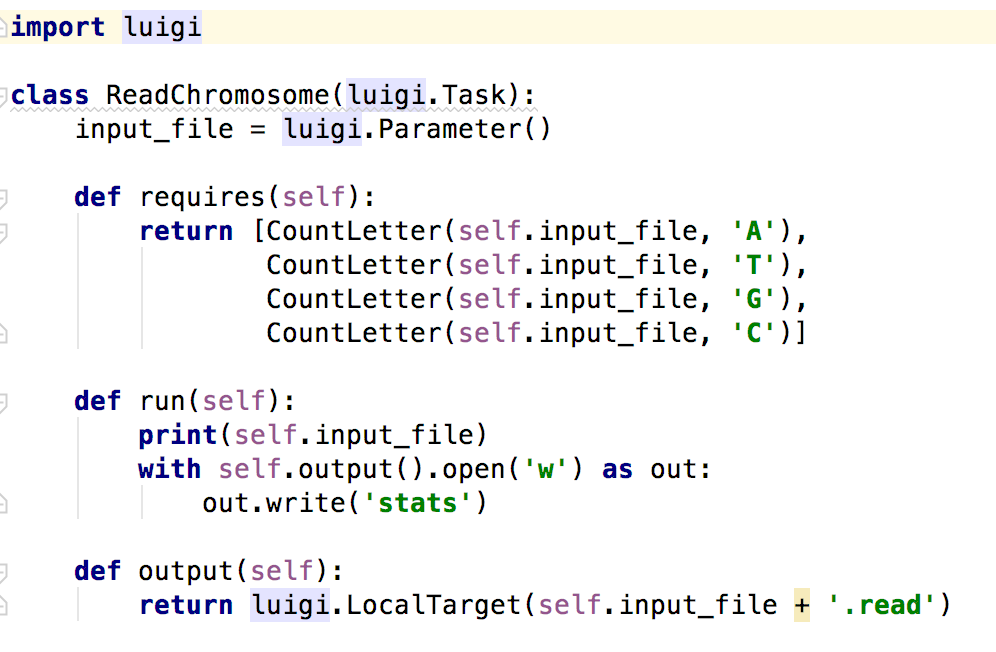

% Python

# Subprocess
## Starting subprocess from Python
`subprocess` Python module provides functionality to execute other programs from inside of Python script.

```Python
import subprocess

subprocess.run(["ls", "-l"])
```

## Checking process status

```Python
import subprocess

result = subprocess.run(["ls", "-l"], stdout=subprocess.PIPE, encoding="utf-8")

if result.returncode == 0:
    print(result.stdout)
```

`returncode` describes if the command was executed successfully - then it has a value of 0 or if the command failed (value other than 0)

## I don't have `subprocess.run()` in my Python

- Python interpreters before 3.5 may miss the `run()` method.
- In such case you may want to use `call()` and `check_output` methods.

## `subprocess.call()` and `subprocess.check_output()`
```python
import subprocess

ret_code = subprocess.call(["ls", "-l"])

print(ret_code)
```
---

```python
import subprocess

output = subprocess.check_output(["ls", "-l"])
output_str = output.decode('utf-8')

print(output)
print(output_str)
```

## Excercises
### 1
Implement a script that lists users logged in to Linux

_Tip_: `w` is the command that lists all logged in users

### 2
Modify previous script so that it displays only user names

_Tip_: use `result.split("\n")` to split the whole output into lines. `result` is the variable where you saved your command output.

# Luigi
## What is Luigi
Luigi is a framework used for managing long running jobs and making sure the processing is fully executed.

In server environment it also provides monitoring of the execution and dependency visualisation.

## Create Virtualenv

```bash
mkdir ~/venv
python3 -m venv ~/venv/luigi

source ~/venv/luigi/activate
```

---

```bash
mkdir ~/venv
virtualenv ~/venv/luigi

source ~/venv/luigi/activate
```

## Installation

```bash
pip install luigi==2.7.1
```

## Running Luigi with central scheduler
Running a central scheduler that is used to manage a workers pool and provides GUI to monitor it [http://localhost:8082/](http://localhost:8082/)

```bash
luigid
```

Then it is enough to schedule luigi job

```bash
export PYTHONPATH='.'
luigi --module longrunning LongRunningParent
```

## Multiple workers

```bash
export PYTHONPATH='.'
luigi --module longrunning LongRunningParent --workers 3
```

## Running Luigi locally

```bash
export PYTHONPATH='.'
luigi --module sample PrintAll --local-scheduler --input-file ./sequence.fasta
```

## Basic building blocks
- `Target` - usually a single file `LocalTarget` or a database entry `MySqlTarget` it is the source and/or the destination of the processing done by the `Task`
- `Task` - single step in processing workflow, it might be reading the content of the file, running a command or just a milestone when all of the previous tasks were executed
- `Parameter`
- `Dependency`

## Task


## Task
- `param = luigi.Parameter(default=42)` - parameter declaration
- `requires()` - defines a list of tasks that need to be finished before current task is executed
- `run()` - this is where computation happens
- `output()` - returns a `Target` where the output is saved

## Parameters

```python
class DailyReport(luigi.Task):
    date = luigi.DateParameter(default=dt.date.today())
```

You can pass a date via command line

```bash
--date 2012-05-10
```
